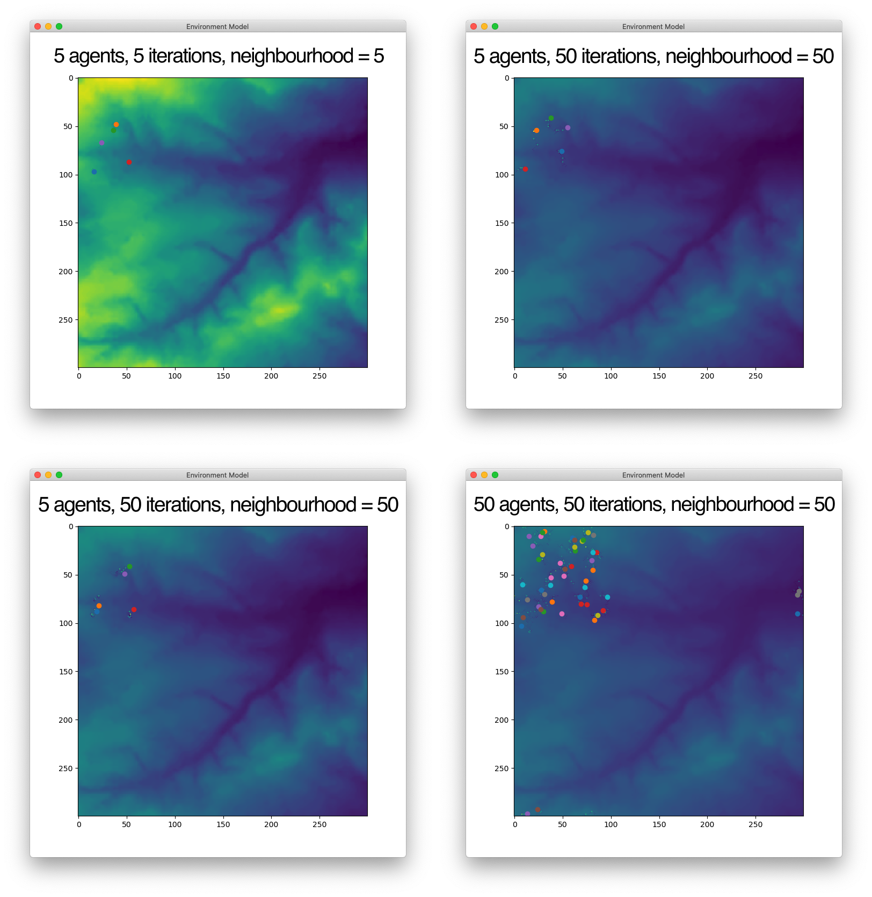

# Agent-Based Modelling with GUI in Python

This is a practice model that creates agents who can interact with
an environment. Put simply, we let X agents onto the field and see them eat stuff.
The program can run with GUI, showing the progress of the agents in an animation
using `matplotlib` library, or run in the "quiet" mode,
writing the resulting environment into a file.

## Project Structure

The Python model is located in the `/model` folder. All output produced goes to `/output` folder.
The screenshots of the model results which are used for the website and this README document
are located in `/images` folder. The webpage is a one-page HTML document `index.html` in the root directory.

```
. 
|___model
|   |-- agentframework.py
|   |-- run_model.py
|   |-- __main__.py
|
|-- output
|   |-- stored.txt
|   |_ (All result environments go here as .txt files)
|
|-- images
|   |_ (Screenshots and webpage images are stored here)
|   
|-- index.html
|-- in.txt
|
│-- LICENSE
|-- README.md
```

## Quick Start

The environment is defined inside the `in.txt` file. It is a CSV-formatted file
with integers corresponding to cell values of the environment. To change the environment,
simply edit `in.txt` in any text editor. Make sure it is a proper rectangle
with no missing values.

### Running with GUI
The simplest way to start the program in GUI is to run the following in the terminal:
```
python model num_of_agents num_of_iterations neighbourhood
```
where `num_of_agents` is the number of agents, `num_of_iterations` is the
number of iterations (steps each agent takes), and `neighbourhood`
is the distance of the neighbourhood (agents are social creatures and like sharing their food with neighbours
who are at most `neighbourhood` units far).

So to run a model with 5 agents and 10 iterations, with the neighbourhood size of 2,
run `python model 5 10 2`.

This command will open up a window. In the menu, go to `Model --> Run model` to start
the animation. You can repeat the interaction as many times as you wish to see the
environment change further.


### Running in "quiet" mode
If you add `nodisplay` as the fourth parameter to the command, like this:
```
python model 5 10 2 nodisplay
```
the program won't show the GUI. Instead, it will write the output in two files.

1. `output/5-10-2.txt`, which has a similar structure to the `in.txt` file, represents
the state of the environment **at the end** of the run. `5`, `10` and `2` values
are the model's parameters as described above.
1. `output/stored.txt` gets a record of the total amount of food stored by all agents.
The file doesn't get overwritten, but instead a new line with a single number gets appended to the end.


### Performing multiple runs with various parameters
More experienced users might want to run the model with multiple parameters to compare
resulting environments. They can manually change the `model/run_model.py` file to set the range
of values for the number of agents, number of iterations, and the neighbourhood distance.

`model/run_model.py` makes use of the `subprocess` library of Python to run the `model` with
various parameters. The output environments are recorded in the `output` folder under
file names consistent to the model's parameters (eg `5-10-2.txt`). To execute, simply
run `python model/run_model.py` in the terminal.

## Example Output (running with GUI)

The following images show the result of four GUI runs with different parameters.
Each screenshot is annotated with relevant parameters.



## About the Agent class
The agent class can be found in `model/agentframework.py`. Apart from the standard
getters and setters for x and y coordinates, it can

* `move()` 1 step in a random direction (but it always checks to make sure it stays within the boundaries of the environment);
* `eat()` 10 units from the environment (if fewer units are stored in a cell, the agent eats it all; if agent
stores over 100 units, it throws up, or in other words returns all its stored units back to the environment);
* `share_with_neighbours()` its resources. The neighbours are those agents located within `neighbourhood`
units from the agent, and the food is being shared equally between the agent and each neighbour, one at a time.
The agent makes use of the `distance_between( agent )` internal function to calculate Pythagorean distance
to determine its neighbours.

When the agent is converted to a string (or printed), it reports is current position (x and y coordinates),
and how many units are stored in the agent. For example,

```
print( agents[0] )
>>> Agent's location is (5, 83). Currently stores 7 units.
```

## Dependencies
The model relies on the following Python libraries:
```
random
operator
csv
sys

tkinter
requests
bs4

matplotlib
matplotlib.pyplot
matplotlib.animation
```

## Credits

Pretty much all the code is based on practicals from *Programming for Geographical Information Analysis* course
at the University of Leeds. It is distributed here under the MIT license.