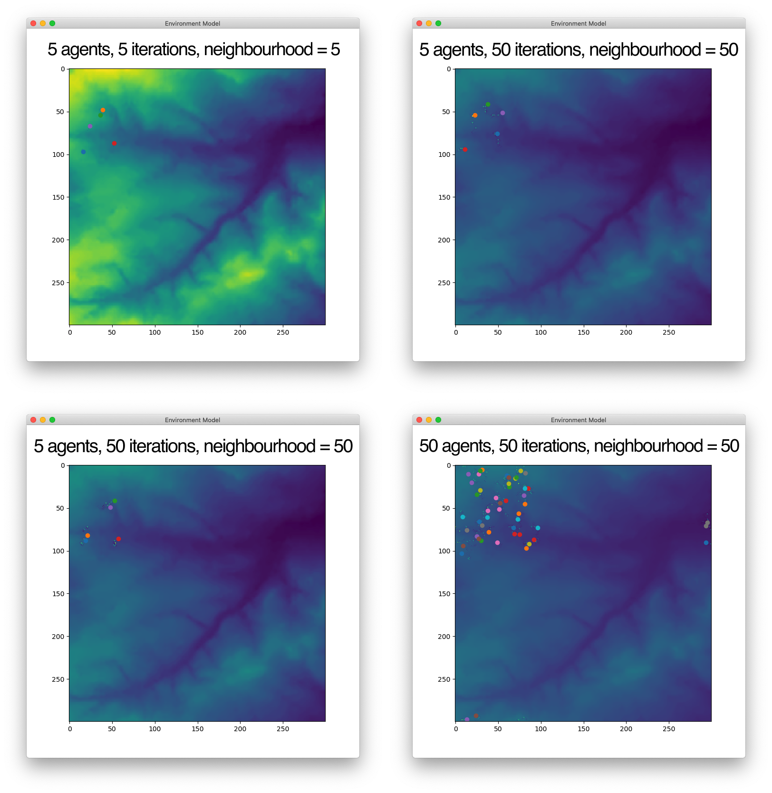

# Environment Model

This is a practice model that creates agents that can interact with
an environment. Put simply, we let X agents onto the field and see them eat stuff.
The program can run with GUI, showing the progress of the agents in an animation
using `matplotlib` library, or output the resulting environment into a file.

## Quick Start

The environment is defined inside the `in.txt` file. It is a CSV-formatted file
with integers corresponding to cell values of the environment. To change the environment,
simply edit `in.txt` in any text editor. Make sure it is a proper rectangle
with no missing values.

### Running with GUI
The simplest way to start the program in GUI is to run the following in the terminal:
```
python model.py num_of_agents num_of_iterations neighbourhood
```
where `num_of_agents` is the number of agents, `num_of_iterations` is the
number of iterations (steps each agent takes), and `neighbourhood`
is the distance of the neighbourhood (agents are social creatures and like sharing their food with neighbours
who are at at most `neighbourhood` units far).

So to run a model with 5 agents and 10 iterations, with the neighbourhood size of 2,
run `python model.py 5 10 2`.

This command will open up a window. In the menu, go to `Model --> Run model` to start
the animation. You can repeat the interaction as many times as you wish to see the
environment deteriorate further.


### Running in "quiet" mode
If you add `nodisplay` as the fourth parameter to the command, like this:
```
python model.py 5 10 2 nodisplay
```
the program won't show the GUI. Instead, it will write the output in two files.

1. `output/5-10-2.txt`, which has a similar structure to the `in.txt` file, represents
the state of the environment **at the end** of the run. `5`, `10` and `2` values
are model's parameters as described above.
1. `output/stored.txt` get a record of the total amount of food stored by all agents.
The file doesn't get overwritten, but instead a new line with a single number gets appended to the end.


### Performing multiple runs with various parameters
More experienced users might want to run the model with multiple parameters to compare
resulting environments. They can manually change the `run_model.py` file to set the range
of values for the number of agents, number of iterations, and the neighbourhood distance.

`run_model.py` makes use of the `subprocess` library of Python to run `model.py` with
various parameters. The output environments are recorded in the `output` folder under
file names consistent to the model's parameters (eg `5-10-2.txt`).

## Result

The following images show the result of four GUI runs with different parameters.
Each screenshot is annotated with relevant parameters.



## Credits

Pretty much all the code is based on practicals from *Programming for Geographical Information Analysis* course
at the University of Leeds. It is distributed here under the MIT license.